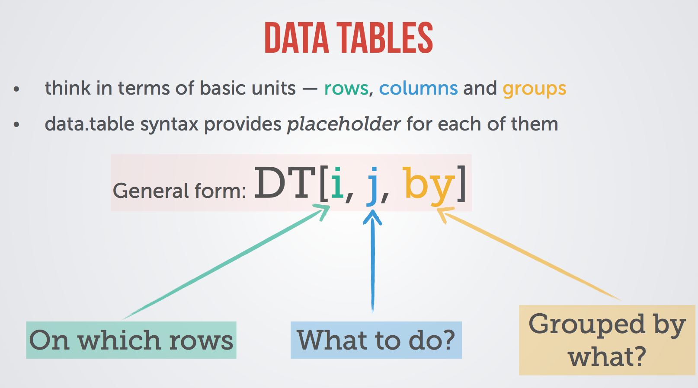

```{r setup, include=FALSE}
knitr::opts_chunk$set(echo = TRUE, warning = FALSE, message = FALSE)
```

## Reading CSV (or any text tabulated) data

`data.table` is a package that extends the data.frame object of base R. It comes with its own functions to read (`fread`) and write (`fwrite`) tabulated data. Those replacement functions for `read.table` and `write.table` are incredibly easy to use and time/memory efficient.

```{r data.table}
library(data.table)
data <- fread(input = "student2/gravi.csv")
head(data)
```

`fread` is able (most of the time) to automatically identify the type and the layout of your data (separators, headers, ...).

## Filtering and manipulating data

The `data.table` object comes with built-in aggregative capabilities (*via* the `by` keyword). A picture is worth a thousand words...

{width=50%}

### Row filtering

The basic *row* filtering is similar to the data.frame method, **except that column names can be used as *variables* **.

```{r row_filtering}
# The data.frame version
# head(data[data$Position == "Courbe",])

# The data.table version
head(data[Position == "Courbe"])
```

Note that with `data.table` the ',' delimiting the *x,y* (or *i,j*) dimensions of the table can be omitted when *j* is empty (meaning you want to return all the columns without further manipulation).

### Data manipulation

At the *j* placeholder, direct manipulation of data can be perform by using column names as variables.

```{r data_manipulation}
data[Position == "Courbe", mean(angle)]
```

The *j* placeholder accepts a **list** of arguments, making possible multiple and simultaneous data manipulations.

```{r multiple_data_manipulations}
# data[Position == "Courbe", list(mean(angle), sd(angle))]
# The same with direct renaming of the new columns
data[Position == "Courbe", list(mean=mean(angle), sd=sd(angle))]
```

### Data grouping

The third placeholder, *by*, is used to aggregate data before the manipulation by the *j* placeholder is performed. *by* accepts as argument a **list** of one or more column names.

```{r aggregation}
data[Position == "Courbe", list(mean=mean(angle), sd=sd(angle)), by=list(NPA, time)]
```

## Go-beyond example

The dataset used in the previous examples was made by students who measured the response of *Arabidopsis thaliana* plantlets to a gravitropic stimulus: the plants were either submitted to the gravitropic stimulus (`Position == "Courbe"`) or not (`Position == "Debout"`) and the role of the phytohormone *auxin* in this response was evaluated by submitting some of the plants to an auxin transport inhibitor (NPA, `NPA == "Avec"` *vs* `NPA == "Sans"`). The quantification of the response was made by measuring the re-orientation of the hypocotyl one day after the onset of the stimulus, expressed as the difference between the angle (the direction of the growth) measured after (day 1, `time == 1`) and before (day 0, `time == 0`) the stimulus. The question was to calculate the mean angle and the standard deviation for each group of experimental conditions.

Here is the way to the one-liner `data.table` solution.

1. For each plantlet in each condition, calculate the 'angle difference' between day 1 and day 0

```{r go_beyond1}
step1 <- data[, list(diff=angle[time == 1]-angle[time == 0]),
              by=list(Position, NPA, Plante)] 
head(step1)
```

2. Calculate the mean and standard deviation for each (Position, NPA) combination of this new data table

```{r go_beyond2}
step2 <- step1[, list(mean=mean(diff), sd=sd(diff)), by=list(Position, NPA)]
step2
```

Both steps can be combined in one line:

```{r final}
my_summary <- data[, list(diff=angle[time == 1]-angle[time == 0]),
                   by=list(Position, NPA, Plante)][, list(mean=mean(diff), sd=sd(diff)),
                                                   by=list(Position, NPA)]
```

## and eventually produce the figure...

```{r basic_plot, fig.height=3, fig.width=5, fig.cap="**My basic plot**."}
library(ggplot2)
# Main parameters of the plot: What are my x ? My y ? 
# On which parameter do I distinguish my data series ?

g  <- ggplot(data = my_summary, mapping = aes(x = Position, y = mean, fill = NPA))

# A 'basic' barplot + error bars
g.basic <- g + 
  geom_bar(stat = "identity", position = position_dodge()) + 
  geom_errorbar(width=.25, aes(ymin=mean-sd, ymax=mean), position = position_dodge(0.9))

g.basic
```

```{r improved_plot, fig.height=3, fig.width=5, fig.cap="**My improved plot**."}
# An improved plot
g.improved <- g.basic +
  scale_fill_manual(values = c("red","blue")) + # changing the colors
  scale_x_discrete(labels=c("Gravitropic stimulus",
                            "No stimulus")) + # changing the x tick labels
  ylab("Gravitopric induced curvature (°)") + # The x axis title
  xlab("") + # The x axis title
  guides(fill=FALSE) # Hide the legend

g.improved
```
